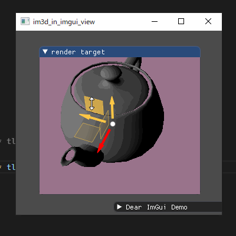

# imgui samples

IMGUI と IM3D の練習

## dependencies

* https://github.com/john-chapman/im3d
  * glew

Define `IM3D_VERTEX_ALIGNMENT=16` is very important.

* https://github.com/nlohmann/json
* https://github.com/SergiusTheBest/plog

## im3d_minimum_xxx

Minimum sample without imgui.
Application is separated 3 parts.

* Window and 3D API. Window back buffer, size and mouse state.
* 3D scene and camera.
* Im3d. Combine window size, mouse state, scene and camera state.

### im3d_minimum_dx11

* Direct3D11

### im3d_minimum_gl3

* OpenGL3 by glew

### im3d_minimum_es3

* OpenGLES3 by Angle

But im3d.glsl is not work. Only teapot.

maybe glDrawArraysInstance ?

### im3d_in_imgui_view_dx11

* Direct3D11
* Render 3D View and Gizmo to renderTarget
* Show renderTarget in `ImGui::Image`
* handling mouse input to renderTarget

